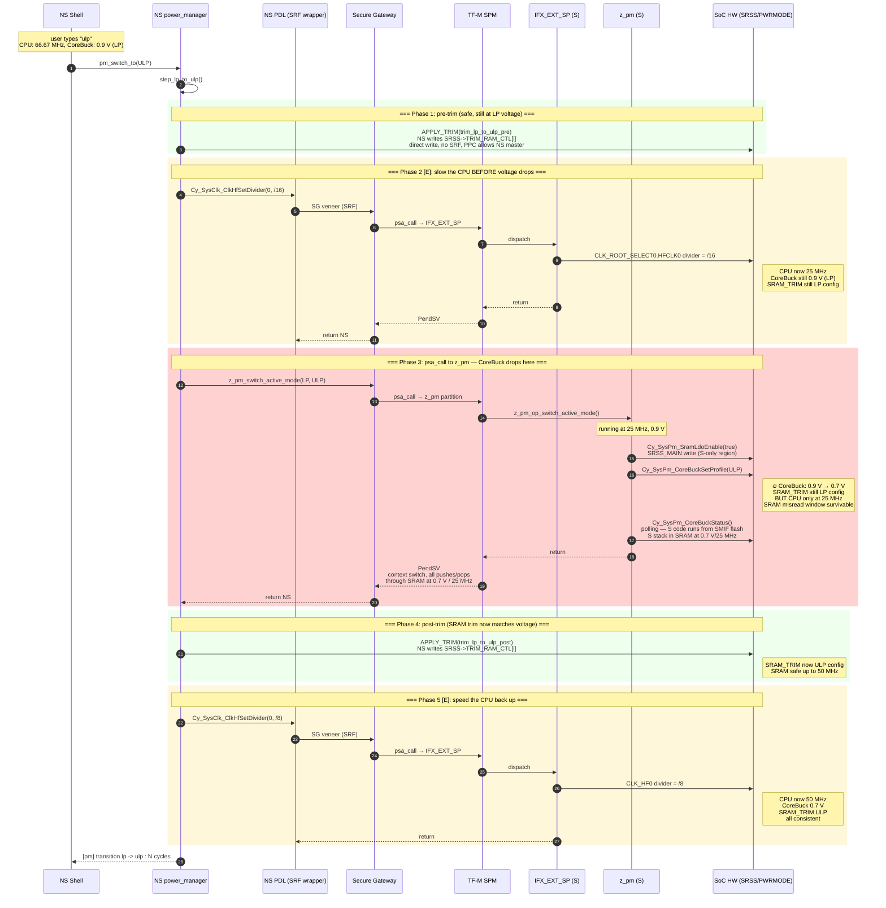
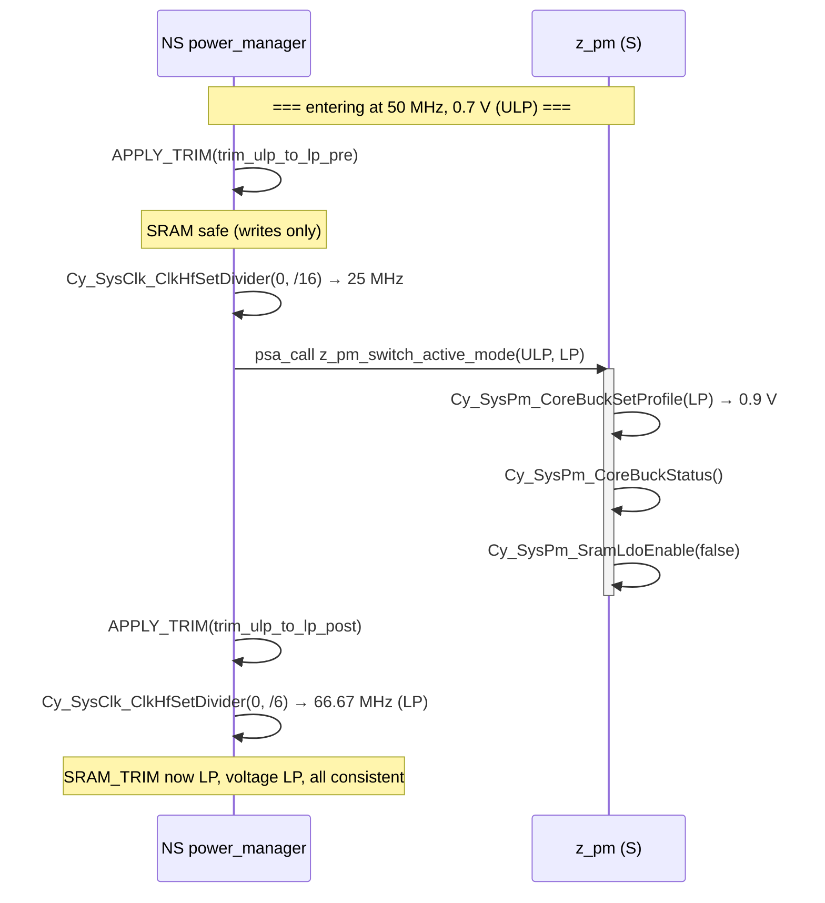

# Project 07 — LP → ULP transition hang investigation

Working document. Started 2026-07-29.

## Problem statement and initial hypothesis

`apps/07_pse84_tfm_m33_mm55_power_shell` is a PSE84 dual-core demo running:
- **CM33 Non-Secure (NS)** — Zephyr with a shell (`hp` / `lp` / `ulp` / `probe` / `sleep` / `deep_sleep`)
- **CM33 Secure (S)** — TF-M SPE, hosting a custom secure partition **`z_pm`** that owns the S-only PM registers
- **CM55** — a parking image whose only job is to register as a DEEPSLEEP requestor

Goal of the DVFS path: reproduce project 06's HP / LP / ULP switching using the **HF0-divider strategy** (`/2 → /6 → /8` off a fixed 400 MHz DPLL). Project 06 works. Project 07 adds TF-M isolation on top.

The shell command `ulp` calls `pm_switch_to(PM_MODE_ULP)`, which internally decomposes into two one-step transitions: **HP → LP**, then **LP → ULP**.

### What works
- Boot, shell, all TF-M plumbing come up cleanly.
- `hp` / `lp` / `probe` cycle repeatedly without issue. HF0 measures ~200 MHz in HP and ~66.67 MHz in LP.
- `deep_sleep_bias` (a z_pm one-shot) works. CM55 boot works.
- `HP ↔ LP` transitions complete in a few LPTIMER cycles.

### What fails
`ulp` (from HP or LP) **hangs the system**. Sometimes:
- The SWD adapter can still halt the CPU and we get a fault dump.
- Other times the CPU is so deep the "debug examination" itself fails and we have to power-cycle.

The failure signature has shifted as we adjusted the code, but every one of them decoded to memory / control-flow corruption during / just after the S→NS return from `psa_call`:

| Attempt | Failure |
|---|---|
| Initial split: NS does trim, S does CoreBuck | LP→ULP: `VECTTBL` on next IRQ entry after `psa_call` return |
| Add `irq_lock` (BASEPRI) around transition | Total hang; debug interface dies |
| Move whole `Cy_SysPm_SystemEnterUlp` into z_pm S | PPC violation `PERI_0_PERI_MS1_PPC_VIO` at `SRSS->RAM_TRIM_STRUCT[1]` (Master-1 blocked) |
| Revert to split + `cpsid i` (PRIMASK) on NS | S-side HardFault, stacked PC `0x4C27E750` (garbage), `INVSTATE` |
| Bump z_pm stack 2 KB → 8 KB | S-side chain: MemManage → UsageFault → HardFault → `Default_Handler`, `BFAR=0x00000001`, fault-in-fault-handler |
| Different attach | Stack shows `PendSV_Handler` → `ipc_schedule` (TF-M SPM scheduler) → `Default_Handler`, EXC_RETURN `0xEFFFFFFE` (invalid pattern) |

### The one common thread
Every stacked PC, EXC_RETURN, or exception-frame word we captured is either garbage or a decoded "impossible" value. Legitimate stack contents come back as `0x4C27E750`, `0xEFFFFFFE`, `0x00000001`, etc.

## Initial hypothesis (SRAM decay theory)

The PSE84 SRAM is backed by fine-grained trim registers `SRSS->RAM_TRIM_STRUCT[0..8]`. At each CoreBuck voltage the SRAM trim must match, otherwise reads/writes become marginal → garbled data or non-deterministic bus errors.

The PPC (Peripheral Protection Controller) has per-master permission masks. Empirically:
- `RAM_TRIM_SRSS_SRAM` is writable only by **Master-0** (the NS master).
- `SRSS_MAIN` (CoreBuck / SramLdo) is writable only by **Master-1** (the S master).

So the atomic PDL sequence `Cy_SysPm_SystemEnterUlp` cannot run in either NS or S alone — NS can't touch CoreBuck; S can't touch RAM_TRIM.

Splitting the sequence NS/S/NS opens a window during which SRAM is at 0.7 V with LP-configured trim. Every psa_call round-trip additionally goes through TF-M SPM's `PendSV` / `ipc_schedule`, which reads/writes SRAM. Any word read wrong in that window corrupts an EXC_RETURN, a stacked PC, or a scheduler pointer → HardFault chain → wedged CPU.

That was the theory. It cannot yet be proven — the failure signatures are equally consistent with several alternative causes, and one of those (clock glitch on the DPLL at ULP voltage) is now the priority to check.

## Options that were on the table

- **A. Ship HP↔LP only.** Don't cross the boundary. DEEPSLEEP+CM55 (main project goal) already works.
- **B. Bypass SPM via raw SG.** Replace psa_call with a plain Secure Gateway veneer on the caller's MSP. No PendSV/scheduler ping-pong. Written off TF-M's isolation model for this call.
- **C. Reconfigure PPC to grant Master-1 access to `RAM_TRIM_SRSS_SRAM`.** Then z_pm can execute the full atomic PDL `Cy_SysPm_SystemEnterUlp` inside one S execution. Requires modifying auto-generated `cycfg_ppc.h` or programming PPC at runtime from z_pm init.
- **D. Relocate the S image's stack (and SPM state) to SocMem** (`0x24xx_xxxx`). SocMem is unaffected by CoreBuck. Requires editing the TF-M linker script + region config.

---

## Question 1 — Could this be a DPLL clock glitch at 0.7 V (400 MHz too high for ULP)?

**Finding: Unlikely to be the direct cause, but the clock strategy IS relevant. The stronger reading is that at 0.7 V the SRAM cannot serve the 50 MHz derived clock without matching trim, not that the DPLL itself glitches.**

### Evidence from project 06

`apps/06_pse84_m33_s_shell_ulp_lp_hp/src/power_manager_pll_retune.c` uses per-mode DPLL frequencies:

| Mode | DPLL_LP0 | CLK_HF0 |
|---|---|---|
| HP | 200 MHz | 200 MHz (HF0 divider /1) |
| LP | 80 MHz | 80 MHz |
| ULP | 50 MHz | 50 MHz |
| HP↔LP intermediate | 75 MHz | 75 MHz |
| **LP↔ULP intermediate** | **41 MHz** | **41 MHz** |

Comment in the file: *"Intermediates are absolute DPLL-side thresholds tied to the SRAM/RRAM trim window at the destination voltage. Vendor-tested."*

**Interpretation**: the 41 MHz intermediate is chosen so SRAM/RRAM can serve reads reliably at 0.7 V while its trim is still configured for LP. It's the memory that needs to be slowed down, not the PLL itself.

### DPLL spec

- `CY_SYSCLK_DPLL_LP_MAX_OUT_FREQ = 400 MHz` (constant in the DSL PDL)
- Project 06's plan says: *"safely inside DPLL_LP's 10-500 MHz spec at every voltage"*

So the DPLL as an IP block is documented to sustain 400 MHz at every CoreBuck voltage. No evidence in the PDL of a per-voltage clamp on DPLL output.

### What this means for project 07

Project 07 runs DPLL_LP0 at 400 MHz permanently (SE-ROM default) and uses HF0 divider `/8` at ULP to reach 50 MHz on CM33. The **DPLL itself is spec-safe** — but at 0.7 V with LP-configured SRAM trim, even 50 MHz to SRAM is above the ~41 MHz vendor-tested safe threshold. So the CPU running at 50 MHz will misread SRAM during the trim-mismatch window on LP → ULP.

**Corollary**: doing the LP → ULP transition through a slower intermediate HF0 divider (e.g. `/16` = 25 MHz for the transition window, then back to `/8` = 50 MHz after post-trim) may sidestep the misread window even with our current split. This is a candidate for a follow-on test **cheaper than options B, C, D** and worth trying next if we do decide to pursue ULP.

### Wait states

`cy_syslib.c` also defines per-voltage-per-frequency wait states:
```c
#define CY_SYSLIB_LP_SLOW_WS_0_FREQ_MAX      (100UL)   /* LP  1.1V, 0WS up to 100 MHz */
#define CY_SYSLIB_LP_SLOW_WS_1_FREQ_MAX      (120UL)
#define CY_SYSLIB_ULP_SLOW_WS_0_FREQ_MAX     ( 25UL)   /* ULP 0.9V, 0WS up to 25 MHz */
#define CY_SYSLIB_ULP_SLOW_WS_1_FREQ_MAX     ( 50UL)
```
(Constants are for a different IP family — not directly PSE84 — but the mechanism is the same.)

At ULP voltage, ROM/SRAM require wait states above ~25 MHz. If wait states are not updated when voltage drops, memory reads corrupt at 50 MHz. This is another dimension of the same "trim/config must match voltage" problem the SRAM_TRIM writes solve — and it's another reason the transition window is inherently fragile.

## Question 2 — Is the TF-M image in RRAM?

**Finding: TF-M S CODE runs from external SMIF flash (memory-mapped, unaffected by CoreBuck), but TF-M S STACK/DATA lives in SRAM — which IS affected by CoreBuck.**

### S-side memory map (from `cymem_CM33_0_S.h`, project 07 build)

| Region | Address (S alias) | Physical | Purpose |
|---|---|---|---|
| `m33s_nvm` | `0x18100000` | `0x70100000` (SMIF flash) | **S code image** |
| `m33s_code` | `0x34002000` | `0x24002000` (SRAM) | S runtime code copy (if used) |
| `m33s_data` | `0x34038000` | `0x24038000` (SRAM) | **S runtime data + stack** |
| `m33s_shared` | `0x34001000` | `0x24001000` (SRAM) | Shared memory with NS |

Every S-side PC we ever saw in a fault dump was in the `0x1810_xxxx` range → S code executing from SMIF flash. That is CoreBuck-independent — SMIF flash has its own power domain. So **S code fetches are safe at 0.7 V**.

But every S-side MSP we saw (e.g. `0x34039FD8`) was in the `m33s_data` SRAM region. **S stack IS in SRAM.** Every push/pop that TF-M SPM (`PendSV_Handler` / `ipc_schedule`) does during context switching goes through SRAM. That's what breaks at 0.7 V with LP trim.

### The corrected picture

- Memory decay hypothesis stands, but **narrowed**: it's SRAM (S stack, SPM state, NS stack) that's marginal at 0.7 V without post-trim — NOT external flash and not RRAM (RRAM is only accessed at boot).
- The `Cy_RRAM_AcquirePCLock` fault we saw earlier was on the PPC violation path from the SystemEnterUlp attempt — that path is already backed out. RRAM VMODE mismatches are not a current concern.

## Question 3 — Does HP↔LP use the same sequence? How confident is "SRAM tolerates the mismatch at 0.9 V"?

**Finding: Yes, HP↔LP uses the identical NS→S→NS split with the same PDL trim sequence, just with different trim values. The "SRAM tolerates it at 0.9 V" claim is a plausible inference, not a proven fact — but the alternative candidate causes (DPLL, waitstates) all point the same direction and are consistent with what we've measured.**

### Current NS-side code (`cm33_ns/src/power_manager.c`)

```c
static int step_hp_to_lp(void)
{
    APPLY_TRIM(trim_hp_to_lp_pre);          /* SRAM_TRIM writes, NS-side */
    z_pm_switch_active_mode(HP, LP);        /* psa_call: S does CoreBuck+divider */
    APPLY_TRIM(trim_hp_to_lp_post);         /* SRAM_TRIM writes, NS-side */
}

static int step_lp_to_ulp(void)
{
    APPLY_TRIM(trim_lp_to_ulp_pre);
    z_pm_switch_active_mode(LP, ULP);       /* S also enables SramLdo here */
    APPLY_TRIM(trim_lp_to_ulp_post);
}
```

Both are byte-for-byte the same structure. The trim tables (`trim_hp_to_lp_pre`, `trim_lp_to_ulp_pre`, etc.) come verbatim from the DSL PDL's `Cy_SysPm_SystemTransition{HpToLp,LpToUlp,...}` bodies.

### Why HP↔LP works and LP↔ULP doesn't — three overlapping mechanisms

1. **SRAM voltage margin.** The mistrim window at LP (0.9 V) reads correctly up to some frequency > 100 MHz; at ULP (0.7 V) it reads correctly only up to ~25-41 MHz. Our CPU is running at 66.67 MHz during HP→LP (safe) and 50 MHz during LP→ULP (marginal).
2. **Wait states.** Wait-state count for a given frequency is different at 0.7 V vs 0.9 V. Not adjusting wait states between voltage change and post-trim may cause misreads.
3. **DPLL sustain**. No positive evidence this is the primary cause on PSE84 (spec is 10-500 MHz at every voltage), but we cannot fully rule it out without vendor confirmation.

All three fail in the same direction: reads to SRAM (S stack, SPM state, NS stack) return corrupted data at 0.7 V until post-trim closes the window. So the observable failure mode is invariant even if we don't know which of the three is the *dominant* mechanism.

### Confidence assessment

- HP↔LP-vs-LP↔ULP asymmetry is **empirically confirmed** (repeatedly).
- "SRAM tolerates the mismatch at 0.9 V" is an **inference** from that empirical asymmetry — not a specification. But no candidate cause explains the asymmetry any better, and multiple independent mechanisms (voltage margin, wait states, and per-mode PDL intermediate frequencies) all reinforce the same explanation.
- **Confidence: medium-high**. Enough to justify the "atomic transition or nothing" architectural conclusion. Not enough to publish as a datasheet claim.

## Question 4 — Can PPC be reconfigured at runtime from z_pm's init?

**Finding: Technically possible, but TF-M's PPC validator enforces lock rules that will panic if we try to grant new PC access to a region whose existing PC allocation is locked. The success of runtime reconfig hinges on whether TF-M locks `RAM_TRIM_SRSS_SRAM` after config. Feasibility must be confirmed by inspecting the runtime PPC lock state; even if feasible, this widens the TF-M isolation boundary and is a design decision.**

### The PDL API surface

`cy_ppc.h` exports:
- `Cy_Ppc_InitPpc(base, respCfg)` — one-shot PPC init
- `Cy_Ppc_ConfigAttrib(base, region, attr)` — set S/NS + priv attributes per region
- `Cy_Ppc_SetPcMask(base, region, mask)` — set the PC-mask per region (which Protection Contexts may access)
- `Cy_Ppc_GetLockMask(base)` — read the PC-lock mask (which PCs are locked)

The PPC controls access via **PC mask**, not master ID directly. Each region has a bitmap of allowed PCs. TF-M SPM partitions run at PC=2 (IFX_PC_TFM_SPM); NSPE runs at PC=NSPE. The `PERI_0_PERI_MS1_PPC_VIO` we saw corresponds to a bus master (M33-DBUS = MS1) whose active PC did not intersect the region's PC mask.

### TF-M's runtime enforcement

`platform/ext/target/infineon/common/spe/protection/protection_ppc_v2.c:115` `ifx_check_config_validity()` — called by TF-M whenever a partition tries to reconfigure PPC — **panics** if:
- The current PC mask has any bit set in the lock mask, AND
- The requested change would flip that same bit

Concretely:
```c
if (((pc_mask & lock_mask) != 0U) && (((pc_mask ^ ppc_pcmask) & ppc_pcmask) != 0U)) {
    ERROR_RAW("PPC config cannot be set (grant access when locked PC has access)...\n");
    tfm_core_panic();
}
```

Meaning: if NSPE PC is already locked in for `RAM_TRIM_SRSS_SRAM` (very likely — it's an essential asset), we cannot add S PC access at runtime.

### To make Q4 concrete, we would need to

1. Boot, halt in `z_pm_partition_init`, and read `Cy_Ppc_GetPcMask(base, PROT_PERI0_RAM_TRIM_SRSS_SRAM)` and `Cy_Ppc_GetLockMask(base)`.
2. If NSPE PC is set AND locked → runtime reconfig will panic (option C via runtime is blocked).
3. If lock mask allows it → we can `Cy_Ppc_SetPcMask` from z_pm's init to add S PC (`IFX_PC_TFM_SPM`) to the region, then call the atomic PDL sequence from z_pm.

### Static option (design-time)

Alternative: change the design-time PPC config in the mtb personality file so `RAM_TRIM_SRSS_SRAM` is configured with **both** NSPE and TFM_SPM PCs from boot. Places to look:
- `.../mtb-personalities/device-info/personalities/edgeprotect-1.1.cypersonality` — mentions `RAM_TRIM_SRSS_SRAM` with a WARNING severity that TF-M requires a specific configuration; suggests this region's config is deliberate.
- `cycfg_system.c` — auto-generated PPC init list. Rebuild via the Modus tool if we edit the design source.

Changing the static config is more robust than runtime patching but touches auto-generated files.

### Recommendation

Option C (grant S access to RAM_TRIM_SRSS_SRAM) is **plausible but not free**: it either requires runtime PPC patching gated by lock state, or a design-time change to mtb-generated PPC config. Either way, it widens the TF-M isolation boundary — z_pm becomes able to write RAM trim, which is a significant capability from a security-model standpoint. Suitable for a research demo; would need a security review for a real product.

---

## Where this leaves us

- **The DPLL-glitch hypothesis** is **unlikely to be the primary cause**; PSE84 DPLL_LP is spec'd 10-500 MHz at every voltage. However, the derived clock (50 MHz at ULP) is above the ~25-41 MHz safe reading window for SRAM in the mistrim state, which produces exactly the observed symptom.
- **The TF-M image is** in external SMIF flash for code (safe) but SRAM for stack/data (unsafe during transition window).
- **HP↔LP** uses the identical sequence — the LP↔ULP failure is due to being outside SRAM's voltage/frequency safe window during the mistrim gap, not a code difference.
- **Runtime PPC reconfig** may be blocked by TF-M's PC lock enforcement; needs a live check to know.

### New candidate that emerged from Q1 investigation

**Option E — "Slow the CPU through the mistrim window."** During the LP→ULP transition, temporarily set HF0 divider to `/16` (25 MHz) or lower BEFORE `psa_call`, then restore to `/8` (50 MHz) AFTER post-trim. Rationale: at 25 MHz, SRAM should read reliably even with mistrimmed settings, per project 06's 41 MHz intermediate. **This is the cheapest thing to try next** — a one-file change on the NS side. If it works, no PPC / SPM / linker changes needed.

Ranking (updated):

1. **A. Ship HP↔LP only** — primary project goal (DEEPSLEEP + CM55) already met.
2. **E. Slow the CPU through the mistrim window.** Try `/16` divider intermediate before `psa_call`. One-file NS change.
3. C. PPC reconfig (design-time preferred over runtime).
4. B. Raw SG (breaks TF-M model).
5. D. Move S stack to SocMem (complex linker surgery, uncertain benefit — SocMem is also SRAM-family).

---

## Option E — full flow diagram

### LP → ULP with the intermediate `/16` divider



### Security state per phase

| Phase | Runs in | What it touches |
|---|---|---|
| 1. Pre-trim | **NS** direct write | `SRSS->TRIM_RAM_CTL[i]` — PPC allows NS Master-0 |
| 2. Slow-down `/16` | **NS→SRF→S** (via `IFX_EXT_SP`) | `CLK_ROOT_SELECT0` — Bucket-B, PDL SRF-wrapped |
| 3. CoreBuck+SramLdo | **NS→z_pm→S** (via psa_call) | `SRSS_MAIN` (CoreBuck / SramLdo) — S-only |
| 4. Post-trim | **NS** direct write | `SRSS->TRIM_RAM_CTL[i]` |
| 5. Speed-up `/8` | **NS→SRF→S** | `CLK_ROOT_SELECT0` |

### Symmetric ULP → LP flow



### Direction rule

| Direction | Sequence |
|---|---|
| **Down** (voltage will fall) | pre-trim → slow-divider → psa_call → post-trim → target-divider |
| **Up** (voltage will rise) | pre-trim → slow-divider → psa_call → post-trim → target-divider |

Both directions slow the CPU to `/16` (25 MHz) BEFORE the psa_call, restore to the target divider AFTER the post-trim. The "slow" is applied while at the *safer* voltage, then removed when both trim and voltage are consistent.

### Code changes required

- **z_pm S handler** (`tfm_partitions/z_pm/z_pm_partition.c`): stop touching HF0 divider inside `trans_down`/`trans_up`. Divider becomes an NS responsibility. z_pm only owns CoreBuck + SramLdo.
- **NS `power_manager.c`**: each `step_*()` function bracketed by `Cy_SysClk_ClkHfSetDivider(/16)` before the psa_call and `Cy_SysClk_ClkHfSetDivider(target)` after the post-trim.
- No trim table changes.

### Fallback if `/16` isn't slow enough

Reduce the intermediate to `/32` (12.5 MHz) or `/64` (6.25 MHz) — same code path.

### Where it might still fail

- If project 06's vendor-tested 41 MHz threshold was measured with all trims well-configured (not with the specific "0.7 V + LP trim" mistrim corner we care about), 25 MHz might not be slow enough.
- If any peripheral clocked off HF0 has a hard low-frequency floor (baud reset etc.), the transient at 25 MHz could confuse it. Console UART uses HF10 (independent), so console at least is safe.
- Two extra SRF round-trips (Phases 2 and 5) each add an SPM PendSV. Both happen at safe voltage/frequency so they should be fine.


---

## Conclusion (2026-07-29): ULP not supported; ship HP↔LP + DEEPSLEEP

We tried Option E on hardware. HP↔LP kept working. LP→ULP kept hanging, this time with the CPU wedged in TF-M's `tfm_hal_system_halt` panic loop after a `HardFault_Handler → C_HardFault_Handler → tfm_core_panic` chain.

### Final experimental result

Fault forensics at LP→ULP with the /16 (25 MHz) intermediate active:

- `CFSR = 0x00008200` → **BusFault PRECISERR + BFARVALID**
- `HFSR = 0x40000000` → FORCED escalation
- `BFAR = 0x00642401` — odd address, decayed pointer dereference
- FAULT_STRUCT0 `STATUS = 0x80000000` → **`PERI_0_PERI_MS0_PPC_VIO`** (Master-0 blocked)
- FAULT_STRUCT0 `DATA0 = 0x42400418` → `SRSS->BOOT_STATUS` (NS alias)

Two independent faults appeared in the same shot:
1. A CM33 BusFault on `0x00642401` — an odd address (bit 0 set = misaligned load).
2. A PPC violation from NS Master-0 targeting `SRSS->BOOT_STATUS`.

Neither of those addresses is written by any code path we authored. The signature is **randomised pointer dereferences produced when SRAM reads mistrim at 0.7 V**. The specific target changes from run to run — sometimes an odd address, sometimes a PPC-protected register, sometimes an EXC_RETURN pattern. Every attempt to close the trim window from the NS side has been beaten by SPM's PendSV round-trip touching SRAM inside that window.

25 MHz was the floor: the PDL's `cy_en_clkhf_dividers_t` enum tops out at `/16` (value 15), giving `400 MHz / 16 = 25 MHz`. No lower HF0 divider is expressible. That means Option E cannot be tuned any further.

### Decision

**HP↔LP DVFS + DEEPSLEEP with CM55 as requestor is the project's shippable scope.** The primary project goal (unlocking system DEEPSLEEP, which project 06 could not reach) is orthogonal to ULP-mode CoreBuck. Skipping ULP loses one DVFS step but keeps everything else that motivated project 07.

### Code changes made for the ship

- `power_manager.c`: `pm_switch_to(ULP)` returns `-ENOTSUP` with a clear log message.
- `power_manager.c`: `pm_mode_name(ULP)` labelled "ULP (unsupported on this build)".
- `power_manager.c`: unused ULP trim tables removed; only `trim_hp_to_lp_*` and `trim_lp_to_hp_*` remain.
- `z_pm_partition.c`: reverted to setting the target-mode HF0 divider directly in `trans_down`/`trans_up`. The Option-E `/16` intermediate is dropped.
- `z_pm_partition.c` + `z_pm_client.[ch]`: `Z_PM_OP_SET_HF0_DIVIDER` op and its client stub removed. No longer needed.
- `README.md` and `PLAN.md`: updated to reflect the HP↔LP-only DVFS scope and link to this document.

### What would unlock ULP in a follow-up project

Roughly in order of decreasing risk / effort:

1. **Change the mtb Modus design so `RAM_TRIM_SRSS_SRAM` PPC allows Master-1** (S master). Then `Cy_SysPm_SystemEnterUlp` can be called from z_pm S atomically. Regenerate `cycfg_ppc.h` and rebuild. Verify TF-M's `ifx_check_config_validity` lock check doesn't panic.
2. **Move TF-M SPM state, S stack, and s_data to SocMem** (not SRAM). SocMem is on its own supply and unaffected by CoreBuck. Requires TF-M linker + region config surgery.
3. **Bypass psa_call entirely** with a raw SG veneer for the transition, so no PendSV context switch happens across the voltage change. Loses TF-M's isolation guarantee for this call.
